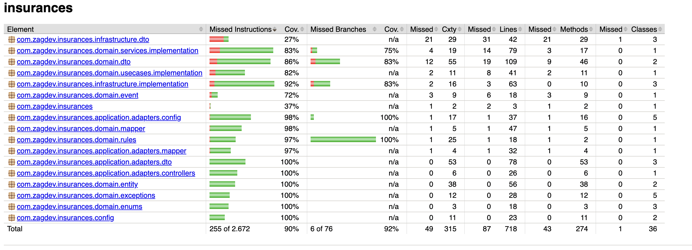

# Seguros

## Sumário

* [Sobre o Projeto](#sobre-o-projeto)
* [Arquitetura](#arquitetura)
* [Como Executar Localmente](#como-executar-localmente)
* [Documentação das APIs](#documentação-das-apis)
* [Mensageria & Integrações](#mensageria--integrações)
* [Testes e Cobertura](#testes-e-cobertura)
* [Premissas e Decisões](#premissas-e-decisões)
* [Possíveis Melhorias Futuras](#possíveis-melhorias-futuras)

---

## Sobre o Projeto

Este projeto implementa o ciclo de vida de **solicitações de apólices de seguro**, incluindo regras de negócio, integração com API de Fraudes (mock), eventos de pagamento/subscrição (RabbitMQ), e publicação de eventos de status para consumo por outros microsserviços.

A arquitetura é orientada a domínio (DDD) e eventos, com testes unitários e de integração.

---

## Arquitetura

* **Spring Boot 3**
* **MongoDB** (persistência)
* **RabbitMQ** (eventos de status)
* **WireMock** (simulação da API de Fraudes)
* **Springdoc OpenAPI** (Swagger) para documentação das APIs
* **Testes:** JUnit, Mockito, Spring Boot Test, WireMock

---

## Como Executar Localmente

### Pré-requisitos

* Java 17+
* Docker + Docker Compose
* Maven

### Buildando o JAR

Caso não queira buildar dentro do próprio Docker Compose:

```bash
./mvnw clean package
```

### Subindo tudo via Docker Compose (recomendado)

1. **Certifique-se de que o arquivo `insurances-*.jar` está na pasta `/target`**
2. Execute:

```bash
docker-compose up --build
```

A API estará disponível em:
[http://localhost:8080](http://localhost:8080)

* MongoDB: `mongodb://localhost:27017`
* RabbitMQ: [http://localhost:15672](http://localhost:15672) (guest/guest)
* WireMock: [http://localhost:8081](http://localhost:8081)

---

## Documentação das APIs

Acesse a documentação interativa dos endpoints no **Swagger UI**:

* [http://localhost:8080/documentation.html](http://localhost:8080/documentation.html)
* [http://localhost:8080/swagger-ui/index.html](http://localhost:8080/swagger-ui/index.html)

> Consulte exemplos de requisição, resposta e explore todos os fluxos disponíveis direto na interface.

---

## Arquitetura Detalhada e Padrões de Projeto

O sistema segue princípios de **Domain-Driven Design (DDD)**, separando as responsabilidades em camadas bem definidas:

* **Camada de Domínio:** Entidades, agregados, serviços de domínio, eventos e regras de negócio.
* **Application Layer:** Orquestração de casos de uso (Use Cases), controllers, adaptação de DTOs.
* **Infraestrutura:** Integração com persistência (MongoDB), mensageria (RabbitMQ), APIs externas (WireMock), repositórios concretos.
* **Adapters:** DTOs, mappers, listeners e publishers desacoplados do domínio.

### Padrões e Princípios Utilizados

* **Domain-Driven Design (DDD):** Organização do domínio, linguagem ubíqua, entidades ricas.
* **Event-Driven Architecture:** Publicação de eventos a cada transição de status via RabbitMQ.
* **Ports & Adapters (Hexagonal):** Interfaces do domínio desacopladas das implementações externas (ex: PolicyRepository, EventPublisher).
* **Factory/Builder Pattern:** Métodos utilitários para criação de objetos de domínio e DTOs, e construção flexível nos testes.
* **DTO / Mapper:** Separação de modelos de domínio e transporte de dados, conversão centralizada.
* **Strategy Pattern:** Aplicação de regras parametrizadas para análise de risco.
* **Exception Handler Centralizado:** Tratamento global de erros com responses padronizadas.
* **Testes em múltiplos níveis:** Unitários para lógica de domínio e integração para APIs, mensageria e persistência.

> O projeto foi desenhado para facilidade de manutenção, testes e evolução. A troca de tecnologias (banco, mensageria, integrações) é facilitada pelo desacoplamento das camadas e interfaces.

---
## Mensageria & Integrações

O projeto utiliza **RabbitMQ** para publicar eventos de mudança de status da apólice e para consumir eventos de pagamento e autorização de subscrição, tornando o ciclo de vida totalmente orientado a eventos.

### Publicação de Eventos de Status

* **Exchange:** `policy-exchange` (tipo `topic`)
* **Routing Key:** `policy.status.changed`
* **Fila:** `policy-status-queue`

**Exemplo de corpo da mensagem publicada:**

```json
{
  "policyId": "d96bfa5e-c123-4bda-8b2a-111111111111",
  "customerId": "e45a08c7-9f47-420c-b5c2-222222222222",
  "newStatus": "APPROVED",
  "occurredAt": "2024-07-21T17:35:21.000Z"
}
```

---

### Consumo de Mensagens (Listeners)

* `payment-result-queue` — Resultado do pagamento
* `subscription-result-queue` — Autorização da subscrição

**Corpo esperado da mensagem consumida:**

```json
{
  "policyId": "d96bfa5e-c123-4bda-8b2a-111111111111",
  "success": true
}
```

* `success = true` indica pagamento ou subscrição aprovada
* `success = false` indica rejeição

---

### Testando manualmente no ambiente Docker

1. **Acesse o painel do RabbitMQ:**
   [http://localhost:15672](http://localhost:15672)
   Usuário: `guest` | Senha: `guest`

2. **Publicar uma mensagem:**

    * Vá em *Queues > payment-result-queue*
    * Clique em *Publish message* e cole:

      ```json
      {"policyId": "<id-da-apolice>", "success": true}
      ```

3. **Consumir mensagens:**
   Mensagens de status das apólices podem ser visualizadas na fila `policy-status-queue`.

---
          
* **WireMock**: mock da API de Fraudes rodando em `http://localhost:8081`

    * Você pode configurar respostas customizadas em `/wiremock`

---

## Testes e Cobertura

* Testes unitários para regras de domínio e transições.
* Testes de integração: APIs, MongoDB, RabbitMQ, WireMock.
* Para rodar todos os testes:

  ```bash
  ./mvnw test
  ```
### Relatório de Cobertura


---

## Premissas e Decisões

* Persistência em MongoDB, mas arquitetura desacoplada permite uso de outros bancos.
* Integrações externas simuladas para fácil reprodutibilidade e testes.
* Documentação sempre disponível via Swagger.

---

## Possíveis Melhorias Futuras

* Autenticação/autorização nos endpoints.
* Pipeline CI/CD com builds, testes e deploy automatizados.
* Internacionalização de mensagens e responses.

---
